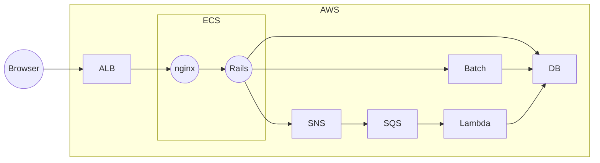
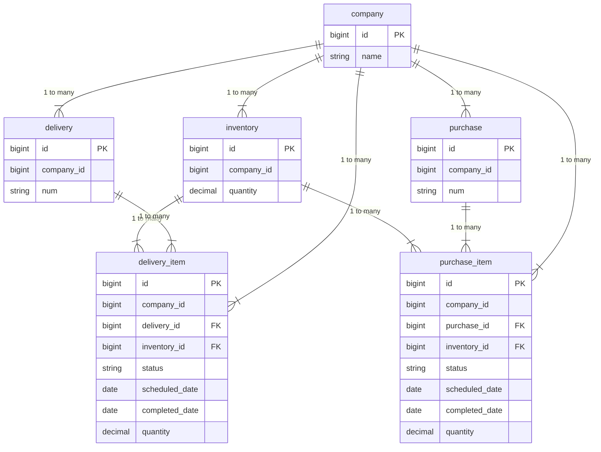

# 特定日時点の予定フリー在庫数

# 問題

Railsを使用したアプリケーションで次の要件を満たすDB設計、インフラ設計、実装の方針を考えてください。

以下の変更は行って良いものとする。

- データベースのテーブル追加、インデックス追加など
- インフラの変更

不明点については質問してください。

# 要件

## 機能
- 特定日時点の予定フリー在庫数を見れるようにする。
    - 過去日は考慮しなくてよい。
- 在庫一覧APIで在庫データと一緒に特定日時点の予定フリー在庫数を返す。
- 在庫詳細ページで予定フリー在庫数の推移をグラフで表示する。
- 入出庫予定日（scheduled_date）は後から更新できるものとする。
    - 更新した場合は更新後の入出庫予定日の予定フリー在庫数を更新する。

## 性能
- アカウント数は1000アカウントを想定。
- 在庫データは1アカウントにつき最大20万件を想定。
- 入出庫データは1アカウント最大100万件を想定。
- 入出庫明細は1在庫データ最大1000件を想定。
- 在庫データの数量が更新されるリクエストは10/分。
- 入出庫データが作成・更新されるリクエストは20/分。
- 特定日時点の予定フリー在庫数の反映は最大3分のラグがあってもよい。

# 用語

- 予定フリー在庫数（logical_quantity）
    - 現在の在庫数に入出庫データのうち、ステータスがcompleted以外の数量を加えたもの。
    - 計算式： `現在の在庫数 + 入庫予定フリー在庫数 - 出庫予定フリー在庫数`

# API

## 在庫一覧API

リクエスト

```
/api/inventories.json?date=$選択した日付
```

レスポンス

```
{
  "inventories": [
      {
          "id": $在庫ID,
          "quantity": $数量,
          "logical_quantity": $指定日時点の予定フリー在庫数,
      }
  ]
}
```

## モデル

テーブルと対となるモデルが定義されています。

# インフラ

大まかなインフラは下記のようになっています。



# テーブル

## 全体図



## company
アカウント

| カラム名 | 型 | NULL | 備考 |
| --- | --- | --- | --- |
|  id | bigint  | NOT NULL | プライマリキー  |
| name | string | NOT NULL | 名前 |

##  inventory
在庫

| カラム名 | 型 | NULL | 備考 |
| --- | --- | --- | --- |
|  id | bigint  | NOT NULL | プライマリキー  |
| quantity | decimal | NOT NULL | 数量 |

## delivery
出庫

| カラム名 | 型 | NULL | 備考 |
| --- | --- | --- | --- |
|  id | bigint  | NOT NULL | プライマリキー  |
| company_id | bigint | NOT NULL | アカウントID |
| num | string | NOT NULL | 出庫番号 |

## delivery_item
出庫明細

| カラム名 | 型 | NULL | 備考 |
| --- | --- | --- | --- |
|  id | bigint  | NOT NULL | プライマリキー  |
| company_id | bigint | NOT NULL | アカウントID |
| delivery_id | bigint | NOT NULL | 出庫ID |
| inventory_id | bigint | NOT NULL | 在庫ID |
| status | string | NOT NULL | 出庫ステータス（none, before, completed） |
| scheduled_date | date  | NULL | 出庫予定日 |
| completed_date | date  | NULL | 出庫日 |
| quantity | decimal | NOT NULL | 出庫数量 |

## purchase
入庫

| カラム名 | 型 | NULL | 備考 |
| --- | --- | --- | --- |
|  id | bigint  | NOT NULL | プライマリキー  |
| company_id | bigint | NOT NULL | アカウントID |
| num | string | NOT NULL | 入庫番号 |

## purchase_item
入庫明細

| カラム名 | 型 | NULL | 備考 |
| --- | --- | --- | --- |
|  id | bigint  | NOT NULL | プライマリキー  |
| company_id | bigint | NOT NULL | アカウントID |
| purchase_id | bigint | NOT NULL | 入庫ID |
| inventory_id | bigint | NOT NULL | 在庫ID |
| status | string | NOT NULL | 入庫ステータス（none, before, completed） |
| scheduled_date | date  | NULL | 入庫予定日 |
| completed_date | date  | NULL | 入庫日 |
| quantity | decimal | NOT NULL | 入庫数量 |

